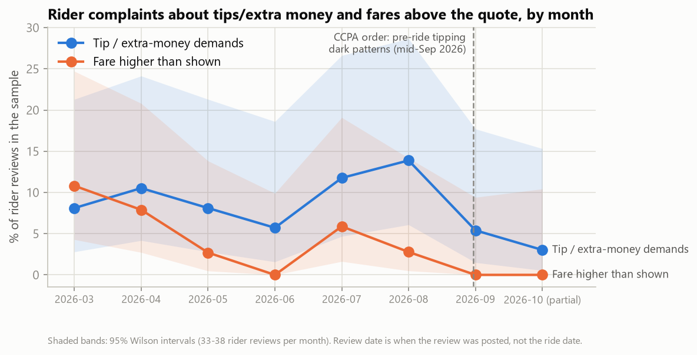

# Rapido: what to fix first (from 585 Play Store reviews, Mar–Oct 2026)

>  Every number comes from `results/metrics.json`.

**Headline:** Riders' biggest complaint is captains asking for more money than the app shows: 23.7% of rider reviews say captains overcharge versus the app fare and another 13.6% report demands for extra cash, while captains' biggest complaint is that their earnings don't cover costs (14.4%). These look like two sides of one pricing problem.

## 1. Safety first (never ranked by the formula)
- **Rider app: 15 reviews (5.2%)** describe safety issues, including harassment ("abusing me and harrassing me"), threats, unsafe rides for women, and **vehicles different from the one registered in the app**.
- **Captain app: 7 reviews (2.4%)**: unsafe working conditions and fraud calls.

## 2. Top issues by app (priority = % of that app's reviews × average severity, 1–5)

| Rider app (287 reviews) | % reviews | Severity | Priority |
|---|---|---|---|
| Captains overcharging passengers ("they take extra money not as per show in the app") | 23.7% | 3.98 | 0.94 |
| Captains demand extra cash ("sabko extra pesa chahiye") | 13.6% | 3.79 | 0.52 |
| Captains rude and demand extra cash | 7.7% | 4.15 | 0.32 |
| Captains frequently cancel rides ("accepted my ride… deliberately canceled it after making me wait") | 5.9% | 4.68 | 0.28 |
| Unresponsive customer support | 9.1% | 3.00 | 0.27 |

| Captain app (298 reviews) | % reviews | Severity | Priority |
|---|---|---|---|
| Earnings don't cover costs ("20 rs main 5 km… petrol bhi nahi niklta") | 14.4% | 3.98 | 0.57 |
| Unresponsive customer support | 13.4% | 3.05 | 0.41 |
| Insufficient earnings ("earning bahot kam he") | 6.4% | 3.95 | 0.25 |
| Too few orders | 6.0% | 3.85 | 0.23 |
| Low per-km fares ("it gives 6rs / km") | 5.7% | 4.00 | 0.23 |

## 3. Rider vs captain: where the problems may connect (hypotheses, not findings)
- Riders: "captains overcharge" ↔ captains: "per-km fares too low". *Hypothesis:* captains recover low platform rates by charging riders extra. *Test:* compare final collected fare with the quoted fare by route length.
- Riders: "captains demand extra cash" ↔ captains: "earnings don't cover costs". *Test:* extra-cash reports vs. trip distance and fuel-cost region.

## 4. Tip and price-pressure trend (CCPA order, mid-Sept 2026)

Before the order (Mar–Aug), **9.7%** of rider reviews mentioned tip or extra-money demands (95% CI 6.4–14.3%). September and October look lower, but the share of rider reviews with *any* complaint fell at the same time and each month has only 33–38 reviews. **Too early to call; this is the metric to watch.** No causal claim.

## 5. What's working
Riders praise **affordable pricing** (4.9%) and **courteous, safe captains** (4.9%); captains praise **earning potential** (3.7%).

## 6. Recommendations
| Issue | Hypothesis | Try | Metric to watch |
|---|---|---|---|
| Fare above quote | Final fare drifts from the quote, especially on cash rides | Lock the upfront fare; one-tap "charged more than shown" report | % rides where collected fare ≠ quoted fare |
| Extra-cash demands | Low per-km pay pushes captains to negotiate off-app | Enforce a no-cash-demand policy with a fast report; test a short-trip fare floor | Extra-cash reports per 1,000 rides |
| Captain earnings | Short trips don't cover fuel | Minimum fare for short trips; show trip earnings before acceptance | Captain earnings per online hour; captain churn |
| Cancellations | Captains cancel low-value rides after accepting | Show trip value upfront; penalise post-acceptance cancels | Captain cancellations after acceptance |
| Support (both apps) | No fast human escalation | Response-time SLA with callback | First-response time; % resolved in 24 h |
| Safety | Vehicle and identity mismatches go unchecked | Ride-start vehicle verification; priority safety queue | Safety reports per 1,000 rides; time to action |

## 7. Method and limitations
LLM extraction of individual complaints with verbatim evidence quotes, hallucination checks, clustering into themes ranked per app (adapted QualIT). Accuracy on 70 held-out reviews: **72.4% recall, 90.1% precision** (phrase level); **43.8% vs 15.2%** theme-level recall against a BERTopic baseline. Limits: reviewers skew negative, so these are **relative signals, not rates**; English-locale Play Store reviews only; review date ≠ ride date; 585 reviews (29–45 per month per app); test labels were written by an AI (Claude), not by hand (a human checked 20 and agreed with all 20); two different models agreed on 66.7% of extracted complaints.
