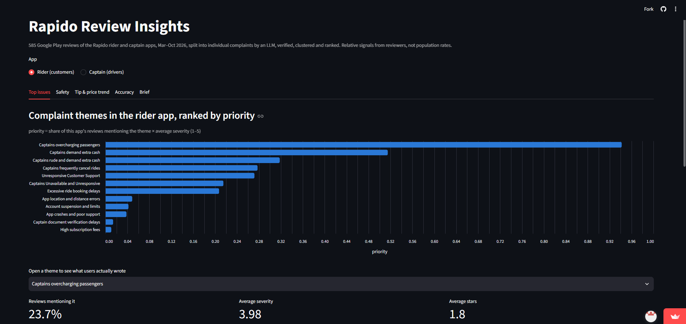
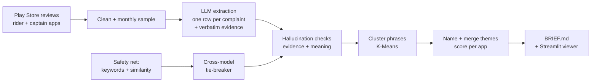

# AI Review Insight Engine: Rapido

**Turns thousands of messy Play Store reviews into a one-page, prioritized product brief a PM can act on, measures its own accuracy, and runs entirely on free tools.**

**[Live dashboard](https://rapido-review-insights.streamlit.app/)** · **[One-page brief](BRIEF.md)** · **[Accuracy report](eval/results.md)**

## Headline finding
Riders' biggest complaint is captains asking for more money than the app shows (**23.7%** of rider reviews: overcharging versus the app fare, plus **13.6%**: demands for extra cash). Captains' biggest complaint is that earnings don't cover costs (**14.4%**). These may be two sides of one pricing problem. → **[Read the brief](BRIEF.md)**




Interactive viewer: **[rapido-review-insights.streamlit.app](https://rapido-review-insights.streamlit.app/)** (rankings, real quotes per theme, safety, trend, accuracy), or locally with `streamlit run dashboard/app.py`.

## Results (70 held-out reviews, never used for tuning)

| Method | Recall | Recall on multi-complaint reviews | Precision |
|---|---|---|---|
| **This pipeline, phrase level** | **72.4%** | **73.3%** | **90.1%** (97.5% after a judge pass on unmatched phrases) |
| This pipeline, theme level | 43.8% | 44.0% | n/a |
| BERTopic baseline (one topic per review) | 15.2% | 17.3% | n/a |

The baseline was made fair, not a strawman: same embeddings, outliers reassigned, topics named with the same prompt and model. **Test labels were written by Claude (an AI), not by hand** ([labeling notes](eval/gold_labeling_notes.md)). Human spot-checks: 20/20 sampled labels judged correct, and 20/20 evaluation-judge decisions agreed with (small samples: 95% CI 84–100%).

## How it works (adapted QualIT)



Based on [QualIT: LLM Enhanced Topic Modeling (arXiv:2409.15626)](https://arxiv.org/abs/2409.15626): extract key phrases with an LLM, check them for hallucinations, then cluster *phrases* instead of whole reviews. **31.4%** of reviews contain two or more distinct issues, which whole-review topic models (one topic per review) can't represent. What this project adds:
- **Verbatim evidence quotes**, checked against the review text (works in Hindi, Hinglish, Telugu).
- **Severity by code, not by the model**: the model picks an impact label (SAFETY, MONEY_LOST, EARNINGS…); a table owned by the PM maps labels to severity.
- **Per-app rankings** (rider vs captain) and a **safety section that is never ranked by the formula**.
- **App-specific theme names**: in Indian bike-taxi usage "rider" often means the *driver*, which confused naming until handled explicitly.

## Reliability design
| Guardrail | Result |
|---|---|
| Model bake-off on dev reviews (main = best Groq model, secondary = different family) | Qwen3.8-27B won recall (75.6% vs 63.4% for gpt-oss-120b at the same threshold) |
| Schema validation per review, retry once | 0 failed reviews |
| Evidence check (fuzzy match, 90+) + meaning check (threshold from known-good dev aspects) | 5 + 28 of 662 aspects dropped |
| Safety net: keywords (English/Hindi/Hinglish) + similarity to seed complaints | flags 44.9% of rider and 46.8% of captain reviews (deliberately low threshold) |
| Cross-model tie-breaker on disputed reviews (OR rule for safety) | 177 reviewed, 14 serious issues added, 5 confirmed |
| Cross-model consistency (Qwen vs gpt-oss on 50 non-test reviews) | 66.7% of complaints matched; 62.9% same impact label (below the 80% target; reported, not hidden) |
| Pinned model, per-row model logging | 97.9% of rows from the pinned model |
| Number check | `check_numbers.py` confirms every number here and in the brief exists in `results/metrics.json` |

## Free stack
| Part | Tool |
|---|---|
| Reviews | `google-play-scraper` (73,200 rider + 29,600 captain raw reviews, Mar–Oct 2026) |
| LLMs | Groq free tier: Qwen3.8-27B (extraction), gpt-oss-120b (tie-breaker, judge, theme names) |
| Embeddings | EmbeddingGemma-300m on a laptop CPU |
| Clustering / baseline | scikit-learn K-Means, BERTopic |
| Viewer | Streamlit |

## Limitations
- **Reviewers skew negative**: these are relative signals, not population rates.
- English-locale Play Store only (Devanagari-script Hindi mostly excluded); review date ≠ ride date.
- **585 reviews** were extracted (29–45 per month per app) because the free tier allows a limited number of tokens per day; trend intervals are wide.
- Test labels written by an AI (Claude), human-checked on a sample of 20 only; cross-model agreement on impact labels is moderate (62.9%).
- The post-CCPA window is a few weeks: no causal claim about the order.

## v2 ideas
Reddit cross-validation · Ownly (food delivery) reviews · Devanagari Hindi reviews · weekly spike alerts after app releases · production sketch: Spring Boot scheduled ingestion → queue → pgvector → REST API.

## How to run
```bash
python -m venv .venv && .venv/Scripts/pip install -r requirements.txt   # full pipeline
cp .env.example .env                                                    # add GROQ_API_KEY, GEMINI_API_KEY, HF_TOKEN
python src/collect.py && python src/clean.py && python eval/make_gold.py
python src/safety_net.py && python src/extract.py --allow-partial
python src/verify.py && python src/cluster.py && python src/label_score.py
python eval/evaluate.py && python eval/baseline_bertopic.py
python analysis/trend.py && python analysis/compare_apps.py && python check_numbers.py
streamlit run dashboard/app.py                                          # viewer only needs dashboard/requirements.txt
```
Every LLM answer and embedding is cached in `cache/`, so reruns are free and reproducible. On a slow laptop, the same scripts run in a free Google Colab or Kaggle notebook (keep `cache/` on Google Drive).
